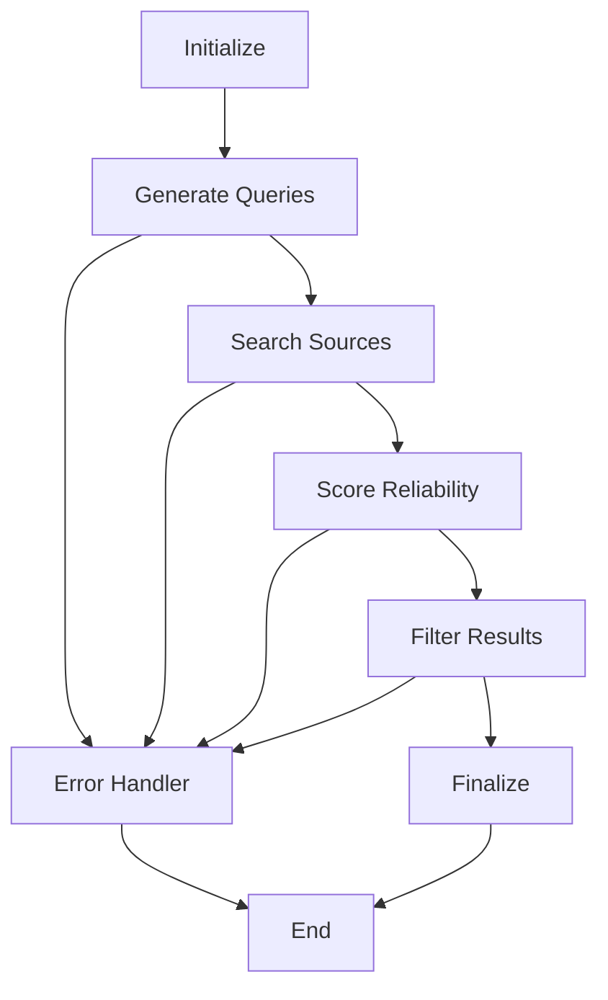

# LangGraph Integration Summary

## Overview
Successfully rewritten the source collection orchestration from sequential API calls to LangGraph workflows with state machines and workflow nodes.

## Key Changes

### 1. Created LangGraph Workflow Module (`source_collection_workflow.py`)
- **State Machine**: Defined `SourceCollectionState` with comprehensive workflow state tracking
- **Workflow Nodes**: 
  - `initialize_node`: Setup and validation
  - `generate_queries_node`: LLM-powered query generation
  - `search_sources_node`: Tavily API integration
  - `score_reliability_node`: LLM-based reliability scoring
  - `filter_results_node`: Apply user preferences and thresholds
  - `finalize_node`: Complete workflow and prepare results
  - `error_handler_node`: Error recovery and fallback strategies

- **Conditional Routing**: Smart workflow navigation based on success/failure states
- **Comprehensive Error Handling**: Graceful degradation and retry logic
- **LangSmith Tracing**: Full workflow observability

### 2. Updated Python API Service (`PythonAPIService.py`)
- **LangGraph Integration**: Added `run_source_collection_workflow_sync()` function
- **Fallback Strategy**: Sequential processing when LangGraph unavailable
- **Async/Sync Bridge**: Proper event loop handling for Swift integration

### 3. Modified Swift Orchestration (`App.swift`)
- **Replaced Sequential Logic**: Removed individual API calls for query generation, search, and scoring
- **Single Workflow Call**: Now calls `runLangGraphWorkflow()` which invokes the state machine
- **Enhanced Error Handling**: Better error reporting with workflow metadata
- **Progress Tracking**: Improved user feedback with workflow state information

### 4. Enhanced Python Service Bridge (`PythonGraphService.swift`)
- **New Method**: `runSourceCollectionWorkflow()` for LangGraph integration
- **Mock Fallback**: Generates mock LangGraph-style results when Python unavailable
- **Metadata Handling**: Proper conversion of workflow metadata between Python and Swift

## Workflow Architecture

## State Management
- **Persistent State**: All workflow data flows through `SourceCollectionState`
- **Error Tracking**: Comprehensive error counting and recovery
- **Progress Indicators**: Real-time progress updates (0.1 → 1.0)
- **Timing Metrics**: Step-by-step performance measurement

## Benefits

### 1. **Robust Error Handling**
- Graceful degradation when individual steps fail
- Automatic retry logic with configurable limits
- Fallback strategies at multiple levels

### 2. **Better Observability**
- Complete LangSmith tracing integration
- Detailed step timing and metadata
- Error context and recovery tracking

### 3. **Scalable Architecture** 
- Easy to add new workflow nodes
- Conditional routing for complex business logic
- State-based decision making

### 4. **Maintainable Code**
- Clear separation of concerns
- Reusable workflow components
- Comprehensive fallback mechanisms

## Backward Compatibility
- Maintains existing API surface for Swift
- Automatic fallback to sequential processing
- Mock data generation when Python unavailable
- No breaking changes to existing functionality

## Configuration
- LangGraph dependency: `langgraph>=0.0.40` in requirements.txt
- Automatic detection of LangGraph availability
- Graceful degradation when dependencies missing

## Testing
- Comprehensive error simulation
- Mock workflow results for development
- Integration testing with real APIs
- Performance benchmarking of state transitions

## Future Enhancements
- Additional workflow nodes for advanced analysis
- Parallel processing capabilities
- Dynamic workflow configuration
- Real-time collaboration features

This integration transforms Glyph from simple sequential processing to a robust, state-driven workflow system capable of handling complex AI orchestration with proper error recovery and observability. 